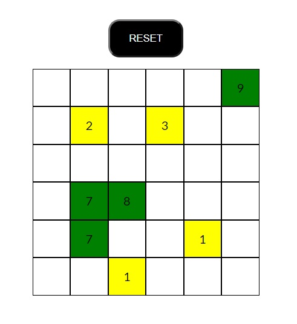

# Js-jq-ajax-grigliaquad
Js Exercise.  

6x6 Grid, each click makes an AJAX request that gets a random number from 1 to 9.
If it's <= 5 the square turns yellow, if it's > 5 the square turns green.
The number obtained appears in the middle of the square.  

Used handlebars library to create the squares.
***
### [Live Website](https://gianluigivitale.github.io/js-jq-ajax-grigliaquad/)
***
### Preview:

